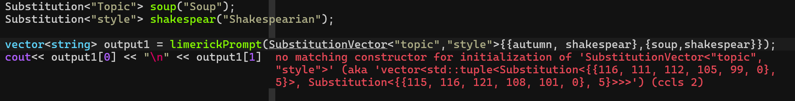

# Prong v0.2

This is a header-only C++ prompt engineering library (hence the name pro-ng). It aims to work well with the STL and limit external dependencies.
The core prong library has no dependencies while the only dependencies for prong\_integrations are on Boost and OpenSSL to support networking for the OpenAI integration.

## What's new in v0.2

### Big Changes
- Experimental chat stream added, see examples
- Added CTest and Google test to CMake 
- Added formatting (Chromium style) using clang-format and CMake

### Bug fixes
- Fixed bug that left trailing null terminators at end of prompt strings
- Fixed bug when overriding one instance of () operator in a derived class would prevent any of the other overloaded () operators from being called even if they had a different signature. Was fixed it by changing interface to specific run and well as runAndStream methods for the derived class to override, making the () operator final
- Fixed a template type deduction failure in message-prompt's batch processing

### Refactors
- Replaced custom applyToTuple function with std::apply
- Deduplicated StringLiteral and TemplateString, StringLiteral is now used for both.


## Features

### Static type safety for substituting in prompts

_"Prompt engineering should be like normal programming"_ --- Bjarne Stroustrup (probably)

Who else hates it when you pass LangChain an input to your chain but it breaks because you misspelled "name" in either your template or argument.
Well, in C++, we can do better.

This example won't compile:
```c++
Prompt<"Hello {name}, what is up with {topic}"> helloPrompt;

Substitution<"user"> logan("Logan");

Substitution<"topic"> weather("the weather");
cout<<helloPrompt(logan, weather)<<endl;
```

And will give this compilation error:
```sh
error: static assertion failed: PromptInput key does not match any placeholder in TemplateString
note: ‘Prong::Prompt<Prong::TemplateString<38>{std::array<char, 38>{"Hello {name}, what is up with {topic}"}}>::containedInPlaceholders<0, 4, Prong::StringLiteral<4>{"user", 4}>()’ evaluates to false
```

However, this example will compile:
```c++
Prompt<"Hello {name}, what is up with {topic}"> helloPrompt;
	
Substitution<"name"> logan("Logan");
	
Substitution<"topic"> weather("the weather");
cout<<helloPrompt(logan, weather)<<endl;

```

It also works when using batch inputs 
(in this case my linter picks up on the invalid constructor)


As well as other prompt types:
```c++
MessagePrompt<"system", "You are {character}. Reply only as {character} regardless of what the user says."> systemMessage;
MessagePrompt<"user", "Write a thoughtful and comprehensive analysis that answers the following question: {question}"> questionMessage;
ChatPrompt<systemMessage, questionMessage> characterAnalysisPrompt;

Substitution<"person"> Palpatine("Emperor Palpatine, a.k.a. Darth Sideous"); 
Substitution<"question"> cupcakesVMuffins("Are cupcakes or muffins the superior confectionary?");

vector<Message> output2 = characterAnalysisPrompt(palpatine, cupcakesVMuffins);
cout<< output2[0] << output2[1] << endl;
```

```sh
error: static assertion failed: PromptInput key does not match any placeholder in TemplateString
note: ‘Prong::Prompt<Prong::TemplateString<125>{std::array<char, 125>{"Hey, {character}. Could you write me a thoughtful and comprehensive analysis that answers the following question: {question}"}}>::containedInPlaceholders<0, 6, Prong::StringLiteral<6>{"person", 6}>()’ evaluates to false
```

### Chains and piping with out of the box parallelization for batch processing

Prompts and Runnables, such as chat models, can be combined to make your prompt engineering code more succinct:

```c++
ChatPrompt<systemMessage> prompt;

OpenAIChatModel gpt(OpenAIChatModel::ModelType::GPT_3_5_TURBO); 

auto chain = prompt | gpt;
```

Additionally, batch processing is parallelized into independent channels for each item in the batch when processed by a chain.
This means that a single item in the batch does not wait for all of the items to finish the current step before starting the next one.
This would be impossible through simple composition of batch functions.

```c++
SubstitutionVector<"topic","input"> input;

for( auto month : months ){
    input.push_back(std::tuple(Substitution<"topic">(month), Substitution<"input">(userInput)));
}

//run chain (executes prompts in parallel behind the scenes)
vector<Message> outputs = chain(input);
```

## Dependencies

To utilize `prong_integrations`, you must first ensure that OpenSSL (minimum version 3.0.2) and Boost (minimum version 1.74) are installed on your system. While these dependencies are not required for building the core `prong` library, they are required for `prong_integrations`.
Note `prong_integrations` has been developed for and tested on Linux. It should work on Mac and Windows for dev purposes. However, https certificate loading is not implemented securely for those systems and it should not be run in production in a Mac or Windows environment (as unlikely as that is).

### OpenSSL Installation

#### Ubuntu
To install OpenSSL on Ubuntu you can use apt-get:
```bash
sudo apt-get update
sudo apt-get install libssl-dev
```

#### Windows
For Windows, you can download the precompiled binaries from [the OpenSSL binaries page](https://wiki.openssl.org/index.php/Binaries) or use a package manager like [vcpkg](https://github.com/Microsoft/vcpkg) or [Chocolatey](https://chocolatey.org/):
```bash
# Using vcpkg
vcpkg install openssl-windows

# Using Chocolatey
choco install openssl
```

#### macOS
On macOS, OpenSSL can be installed using [Homebrew](https://brew.sh/):
```bash
brew install openssl
```

### Boost Installation

#### Ubuntu
To install Boost on Ubuntu, you can also apt-get
```bash
sudo apt-get update
sudo apt-get install libboost-all-dev
```

#### Windows
For Windows, you can download the precompiled binaries from [the Boost downloads page](https://www.boost.org/users/download/) or use a package manager like [vcpkg](https://github.com/Microsoft/vcpkg) or [Chocolatey](https://chocolatey.org/):
```bash
# Using vcpkg
vcpkg install boost

# Using Chocolatey
choco install boost
```

#### macOS
On macOS, Boost can also be installed using [Homebrew](https://brew.sh/):
```bash
brew install boost
```

**Note:** This library has only been tested with OpenSSL 3.0.2 and Boost 1.74 in a Linux environment

## Linking to the Prong Library in Other Projects

You can integrate the Prong library into your projects either by directly including the header files or by installing the library with CMake and then using it in your project's CMake configuration.

### Direct Inclusion
Copy the `include/prong` and `include/prong_integrations` directories into your project's include path.

### Using CMake
First, install Prong by running CMake in your Prong project directory:

```bash
mkdir build && cd build
cmake ..
make install
```

Then, to use Prong in your project, add the following to your CMakeLists.txt:

```cmake
find_package(Prong REQUIRED)

target_link_libraries(your_target_name
    Prong::prong
    Prong::prong_integrations
)
```

## Building the Examples

To compile the example programs:

1. Navigate to the `/examples` directory.
2. Generate the build system by running `cmake .`
3. Compile the examples using `make`.
4. Execute any of the example binaries to see Prong in action.


## Library overview - Core Prong Library

The core Prong library includes all the core prompt engineering functionality and has no external dependencies or 3rd party integrations.
All the files can be found under include/prong

### Basic Data Types

**StringLiteral**

- A custom data type that allows us to use string literals as template parameters

**TemplateString**
 
- A custom data type that allows us to instantiate prompts from TemplateStrings
- Will add some more static type safety features unique to TemplateStrings down the line but is currently basically the same as StringLiteral

**Substitution**

- The input type for all prompt types. Interacts with underlying TemplateStrings of prompts at compile time to ensure there is no key mismatch

### Prompt Types

**Prompt** 

- The base prompt type. 
- Handles placing Substitutions into template strings. 
- Also checks whether Substitutions are valid. 
- Returns a simple std::string when passed Substitutions.

**Message**

- Simple message class, has content, role and << operator.

**MessagePrompt** 

- A prompt type that returns a Message when passed Substitutions.

**ChatPrompt**

- A prompt type that contains a collection of MessagePrompts and outputs a std::vector of Messages when passed Substitutions.

**PromptRunnable**

- A prompt type that is created by combining another PromptRunnable or prompt type with a Runnable. Returns whatever the output of its Runnable is when passed Substitutions.

### Runnables

**Runnable**

- Core runnable class that handles parallelization of sub-classes such as ChatModel. Also has a utility streaming operator() method that can be overloaded for different behavior
- Abstract class - the deriving class must override the run method and optionally the runAndStream method

**CombinedRunnable** 

- A container to house chained runnables after the use of the | operator
- The difference between CombinedRunnable and PromptRunnable is that CombinedRunnable starts with a pure runnable and PromptRunnable with a prompt type

### Utils

**SubstitutionVector**

- Type alias for convenient usage of lists of Substitutions without needing to create tuples for a batch input.
- Can use in place of vector of tuples when passing multiple Substitutions to a prompt type.(Is a little unstable so use with care.)


## Library overview - Prong Integrations

This includes external integrations and utilities to support those integrations. There is currently only one integration, OpenAI's ChatModel.
All the files can be found under include/prong\_integrations

### Utils

**SimpleHTTPClient:**
- Makes an http request and returns the response (either raw or in JSON format)

**SimpleHTTPSClient:**
- Makes an https request and returns the response (either raw or in JSON format)

**RootCertificates:**
- A helper file to support https on non-linux systems
- System certificates are used on linux, but interacting with Windows and Mac operating systems was beyond the scope of this library
- This file contains a bunch of certificates so that Windows or Mac can be used as a development environment but this should not be used in production as it violates _many_ security best practices.

### Runnables

**HTTPRunnable:**
- A virtual Runnable class that requires subclasses to specify HTTP parameters, input parsing & output parsing
- Handles interaction with the http/https clients

### ChatModels

**OpenAIChatModel:**
- An implementation of a ChatModel using OpenAI's completions endpoint
- Is built by inheriting from HTTPRunnable
- Supports different models (e.g. GPT4 turbo) which can be selected when constructing an instance
- Unfortunately, streaming is not supported at this time

## Examples

### Prompt Type Safety

This example showcases Prong's prompt static typesafety features

### Simple Chat Model

This example shows how to define your own simple chat model

### OpenAI Chat Model

This example shows how to interact with OpenAI's chat model

### Chains and Runnables

This example showcases chains and parallel batch processing

## Acknowledgments

1. This project is inspired by the LangChain library, created by Harrison Chase and managed by LangChain, Inc. 
2. The http and https clients, as well as the root certificates file are primarily based on examples by Vinnie Falco from the boost::beast library.
